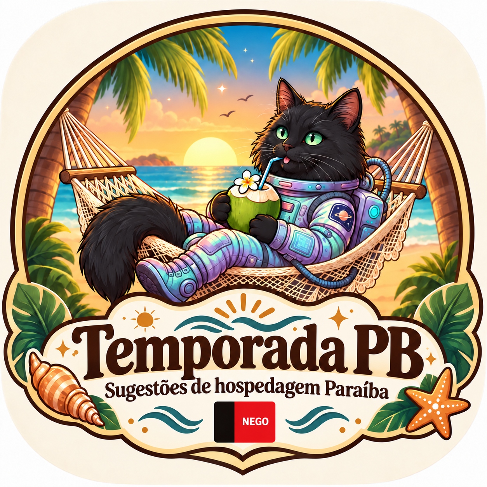

# Temporada PB 🌴

  

  <strong>Sugestões de hospedagem Paraíba</strong>

  Um guia independente para facilitar a pesquisa de hospedagens na Paraíba e direcionar cada pessoa para a fonte original.

---

## Sobre

Com o mesmo intuito do **Guia da Vênus**, o **Temporada PB** foi criado pensando nos nossos amigos que vêm de outros estados e querem passar uma temporada na Paraíba.

Com a alta procura por imóveis para aluguel de temporada e a grande quantidade de sites com esse propósito, pensamos em uma forma de **facilitar e organizar essa busca**.

A **Casa de Praia Vênus** continua sendo nossa primeira opção. Quando ela não estiver disponível, o Temporada PB apresenta outras sugestões para ajudar na pesquisa, sempre direcionando para a **fonte original** de cada hospedagem.

A proposta é manter uma experiência **simples, leve e acolhedora**, reunindo informações úteis em um só lugar sem substituir a consulta ao anúncio, perfil ou plataforma responsável pela hospedagem.

---

## 🌿 Como funciona

1. A **Casa de Praia Vênus** aparece como primeira opção.
2. Quando não houver disponibilidade, o guia apresenta outras sugestões de hospedagem.
3. É possível pesquisar por cidade, região e características disponíveis.
4. Ao encontrar uma opção interessante, basta acessar a **fonte original**.
5. Disponibilidade, valores, regras, políticas e demais informações devem ser confirmados diretamente com a hospedagem ou plataforma.

---

## ☀️ A proposta

O **Temporada PB** não é um site de reservas.

A ideia é tornar a procura por hospedagem mais simples, reunindo opções que podem ajudar quem vem conhecer João Pessoa, Conde e outras áreas contempladas no projeto.

O projeto mantém uma proposta de apoio à pesquisa, com navegação simples, informações organizadas e acesso direto à fonte original.

---

## 🏡 O que você encontra

- Casa de Praia Vênus em destaque;
- sugestões de outras hospedagens;
- pesquisa por cidade;
- filtros complementares;
- favoritos;
- acesso à fonte original;
- informações apresentadas somente quando disponíveis;
- funcionamento adaptado para celular;
- possibilidade de instalação como PWA.

Quando uma informação não estiver disponível na fonte consultada, o guia não deve inventar ou presumir o dado.

---

## 🌊 Importante

As opções apresentadas neste guia são **indicações independentes de apoio à pesquisa**.

A inclusão de um local ou hospedagem é gratuita e **não gera pagamento, comissão, benefício ou qualquer contrapartida para o projeto**.

O Temporada PB não realiza reservas, não recebe pagamentos e não intermedeia contratos.

Consulte sempre a **fonte original** antes de contratar, reservar ou realizar qualquer pagamento.

---

## 📱 Acesse o Temporada PB

**https://temporada-pb.vercel.app/**

Pode ser aberto pelo celular e, em navegadores compatíveis, instalado como aplicativo.

---

## 💛 Projeto

Projeto pessoal desenvolvido para facilitar a pesquisa de hospedagens e ajudar amigos e visitantes que vêm conhecer a Paraíba.

**Desenvolvido por Priscilla Cahino**