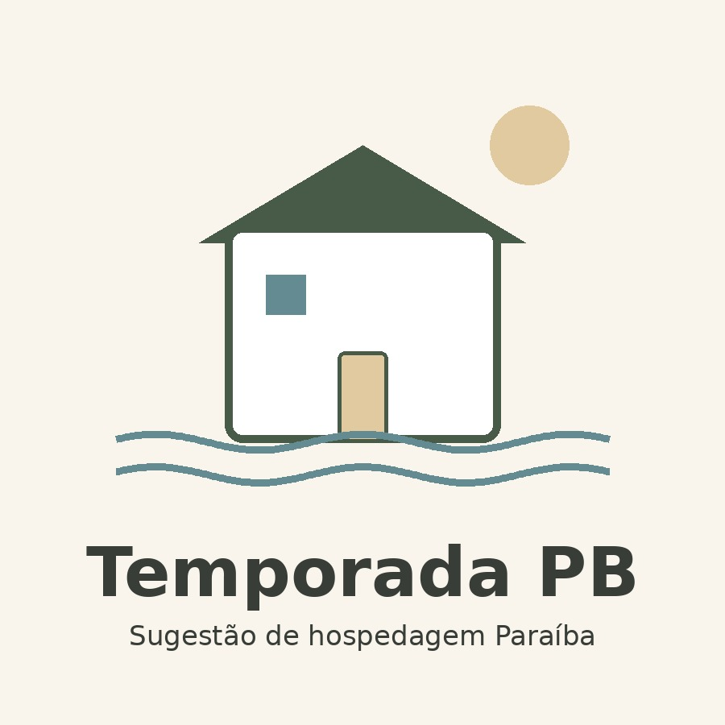

# Temporada PB 🏡 🌴

  

  <strong>Sugestão de hospedagem Paraíba</strong>

  Um guia independente para organizar a pesquisa de hospedagens e levar você até a fonte original.

---

## Sobre

O **Temporada PB** é um projeto independente criado para facilitar a pesquisa de hospedagens na Paraíba.

A proposta é reunir opções encontradas em perfis oficiais e plataformas de hospedagem, permitindo comparar informações básicas antes de seguir para a fonte original.

O projeto **não realiza reservas, não recebe pagamentos, não intermedeia contratos e não garante disponibilidade, preços ou condições anunciadas por terceiros**.

> **Independência de marca:** o Temporada PB não possui vínculo com a marca Vênus. Não é produto, extensão, serviço, canal de reservas, parceria, representação ou indicação oficial da marca Vênus.

---

## 🌿 Como funciona

1. Consulte as opções cadastradas.
2. Use filtros de região, capacidade e características.
3. Confira os dados disponíveis no guia.
4. Abra o perfil, site ou anúncio original da hospedagem.
5. Confirme diretamente na fonte original disponibilidade, valores, datas, regras, localização e comodidades.

---

## 🏡 O que você encontra

- casas, apartamentos e estúdios;
- filtros por região e características;
- favoritos armazenados no navegador;
- indicação da origem da informação;
- acesso direto à fonte original;
- experiência adaptada para celular;
- instalação como PWA em dispositivos compatíveis;
- acesso offline aos arquivos já armazenados pelo aplicativo.

---

## 🌊 Importante

O **Temporada PB** funciona apenas como apoio à pesquisa.

As hospedagens listadas são independentes. A presença de uma opção no guia não representa parceria, recomendação comercial, garantia de qualidade ou intermediação.

Antes de qualquer reserva, confirme todas as informações diretamente com a hospedagem ou plataforma responsável pelo anúncio.

---

## 📱 Acesse

👉 **https://temporada-pb.vercel.app/**

---

## 🛠️ Tecnologias

HTML5, CSS3, JavaScript, JSON, PWA, Service Worker, LocalStorage e Vercel.

---

## 👩‍💻 Projeto

Projeto pessoal desenvolvido por **Priscilla Cahino** com foco em organização de informações, experiência do usuário e acesso simplificado às fontes originais.

---

**Desenvolvido por Priscilla Cahino**