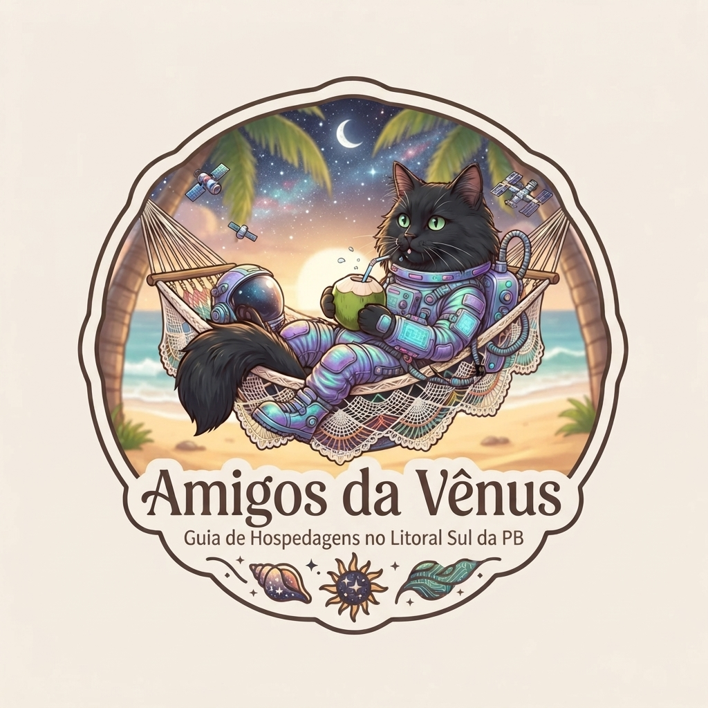


# Amigos da Vênus 🐈‍⬛ 🌿🌊

  

  <strong>Um cantinho para ajudar amigos a encontrarem outros cantinhos. 🌿☀️</strong>

---

## Sobre

Com o mesmo intuito do **Guia da Vênus**, o **Amigos da Vênus** foi criado pensando nos nossos amigos que vêm de outros estados e querem passar uma temporada na cidade onde o sol nasce mais cedo.

Com a alta procura por imóveis para aluguel de temporada e a grande quantidade de sites com esse propósito, pensamos em uma forma de **facilitar e organizar essa busca**.

E, claro, se a **Casa de Praia Vênus** não estiver disponível, não vamos deixar ninguém na mão. Afinal, o que vale é **curtir a vida, aproveitar bons momentos e ajudar o próximo**.

Por isso, a proposta do projeto é ser um guia **simples, leve e acolhedor**, reunindo opções de hospedagens para pesquisa e direcionando sempre para a **fonte original** do anúncio ou perfil, onde cada pessoa pode confirmar disponibilidade, valores e demais informações.

A ideia é que o **Amigos da Vênus** funcione como aquele amigo que diz:

> **“A Vênus está ocupada, mas calma que eu te ajudo a encontrar outro cantinho.”**

---

## 🌿 Como funciona

1. A **Casa de Praia Vênus** é sempre a nossa primeira opção.
2. Se não houver disponibilidade, o guia apresenta outras hospedagens.
3. Você pode comparar regiões, capacidade e características.
4. Encontrou uma opção interessante? É só acessar a **fonte original**.
5. Disponibilidade, valores, regras e demais informações são confirmados diretamente com a hospedagem ou plataforma.

---

## ☀️ A proposta

O Amigos da Vênus não nasceu para ser mais um site de reservas.

A ideia é tornar a procura por hospedagem um pouco mais simples, reunindo em um único lugar algumas opções que podem ajudar quem vem conhecer João Pessoa e o litoral sul da Paraíba.

Tudo com a mesma energia que inspira a Vênus:

**leveza, acolhimento, natureza, boas energias e vontade de ajudar.**

---

## 🏡 O que você encontra

- Casa de Praia Vênus em primeiro lugar;
- outras opções de hospedagem;
- casas, apartamentos e estúdios;
- busca por região;
- filtros simples;
- favoritos;
- perfis oficiais e anúncios em plataformas;
- acesso direto à fonte original;
- funcionamento adaptado para celular;
- possibilidade de instalar como aplicativo.

---

## 🌊 Importante

O **Amigos da Vênus** é um guia independente de apoio à pesquisa.

Não realizamos reservas, não recebemos pagamentos e não intermediamos contratos.

As hospedagens alternativas não possuem vínculo comercial com a **Casa de Praia Vênus** ou com o **Amigos da Vênus**, salvo quando isso estiver expressamente informado.

Quando alguma informação não estiver disponível no guia, ela deve ser confirmada diretamente com a hospedagem ou na fonte original.

---

## 📱 Conheça o Amigos da Vênus

👉 **https://temporada-pb.vercel.app/**

Pode abrir pelo celular e, em navegadores compatíveis, instalar como aplicativo.

---

## 💛 Feito com boas energias

Um projeto criado para facilitar a vida de quem vem de longe, conhecer novos lugares e aproveitar bons momentos.

**Amigos da Vênus**  
Porque, se a Vênus estiver ocupada, a gente ajuda você a encontrar outro cantinho. 🌿🌊🐈‍⬛

---

**Desenvolvido por Priscilla Cahino**

---

## Foto principal da Casa de Praia Vênus

A área de destaque da **Casa de Praia Vênus** utiliza uma imagem armazenada no próprio repositório em `icons/casa-venus-destaque.jpg`.

Isso evita dependência de links externos e mantém a apresentação consistente no site e na versão instalada como PWA.
